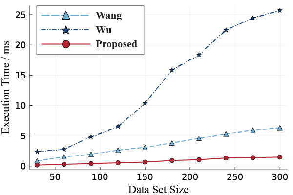
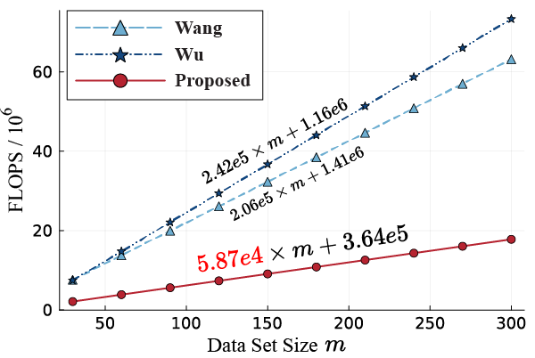

# Benchmark
## Prepare files
The point cloud data are so sparse but space inefficient. We therefore compress all data points in a .zip file. You can access the zip file in [this link](https://drive.google.com/file/d/1KBOPB5leS9vUCu4oeyLxHO-R50ZSIwa4/view?usp=sharing). Unzip the file at `./Experiments/`. Make sure the point clouds are located at `./Experiments/meshes/Validation_New/balls/*.ply`, trajectories are located at `./Experiment/traj/...`, and results are located at `./Experiments/result/...`.

## Reproduce results in the paper
### Fig. 4-6

```
cd GA_MultiRobot
julia --project=. -O3 ./Benchmark/Paper_Benchmark_Sim_AIO.jl U 1000
julia ./Benchmark/Plot_Sim_Benchmark_Result.jl U 1000
```
**The `Paper_Benchmark_Sim_AIO.jl` execute the actual simulation with multi-processing, make sure you have enough RAM to run the script**. My workstation has 24 threads and 32GB of RAM, the program will take ~13GB of RAM. If your system does not have enough RAM, read the README.md in `./Benchmark` to modify the multiprocessing config manually.

The first parameter `U` indicates a uniform distributed noise. The second parameter `1000` tests all algorithms 1000 times. If it takes too long for 1000 runs, (20 mins on my machine, time may vary violently depends on your multi-core performance), we recommend 100 runs which may only slightly compromise the result but still presents the main idea.

The result can be found in `./images/Paper_Bench_Sim_AIO_1000_uniform/*`

### Fig. 7

This fig generates in a Pluto notebook. [Pluto](https://github.com/fonsp/Pluto.jl) is a Jupyter-like Julia IDE.
So first, we open a Pluto server.
```
cd GA_MultiRobot
julia   # enter Julia REPL
julia > ]
(@v1.8) pkg > activate .
(GA_MultiRobot) pkg > #hit backspace here
julia > using Pluto
julia > Pluto.run()
```
A webpage will automatically pop up in your default browser. All you need to do is find this file in pluto `./Benchmark/Speed_Benchmark.jl`

It may take a while for the script to run.

Fig. 7 is extract from the first fig in section "Descent Speed Test".

### Fig 8

For Fig. 8
```
cd GA_MultiRobot
julia --project=. -O3 ./Benchmark/Paper_Compute_Speed_Benchmark.jl
```
This script takes solid 10\*14\*5 = 700s to run. You can find the result in `./images/Benchmark_Computation_Speed/*`.

### Fig 9

This script counts the FLOPs of algorithms. The tool it uses is LIKWID, which requires Linux system and Intel CPU early than 11th gen and AMD CPU earlier than Zen 3. The result is shown below.

If you would like to reproduce the result by yourself. You need to 
1) find a system that satisfies the requirement of [LIKWID](https://github.com/RRZE-HPC/likwid). 
2) install LIKWID and build it as a shared library 
3) add the library to your LD_LIBRARY_PATH on Linux 
4) run the script in the same terminal that has the library in LD_LIBRARY_PATH
5) run `julia --project=. -O3 ./Benchmark/Paper_Flops_Benchmark.jl`

### Fig 10-11
Fig. 10 Rotation Error Propagation            |  Fig.11 Translation Error Propagation 
:-------------------------:|:-------------------------:
  |  

```
cd GA_MultiRobot
julia --project=. -O3 ./Benchmark/Paper_Benchmark_ErrorProp.jl
```
The scripts will test the effect of error propagation, both from the rotation part to the translation part, and from the rotation part to translation part. The results will be shown in `./images/Paper_Sim_ErrorProp_1000_normal`.

### Fig 15

Fig 15 comes from physical experiment data. You should put the data in its right path.
1) Unzip the data and copy its content into `./Experiments/`
2) The `Experiments` folder should have the following structure
* Experiments
    * result/       # Comes from data.zip
    * traj/         # Comes from data.zip
    * meshes/       # Comes from data.zip
    * AXBYCZ.jl
    * pre_process.jl
    * validation_set_processing.m
3) Open a Pluto server as in Fig. 7
4) Open the `AXBYCZ.jl`
5) Wait for a while and let the code run, it takes around 80s on my PC. The run time mainly depends on your single core performance

The result can be found in section `Four Fold Cross Validation`

### Table VI
After running the `AXBYCZ.jl` script, the calibrated `X,Y,Z` of all algorithms are saved at `./Experiments/result/XYZ/XYZ_all.mat`.
To compute the final result of the measurement experiment, we need to run a script in MATLAB.

1) open MATLAB
2) cd to `./Experiments`
3) run `validation_set_processing.m`

**The .m script runs in parallel for speed, so make sure you have enough RAM on your PC.**
You can simply replace the `parfor` in the script by `for` for a single process execution.