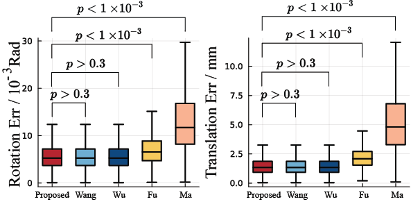

# Experiment
## Description
Two physical experiments are carried out to varify the effectiveness of the proposed algorithm. Results are compared with the state-of-the-art algorithms.

## Experiment 1:
*Section V: Cross Validation* in the paper


## Experiment 2:
*Section VI: Measurement Experiments* in the paper


## Dataset Setup
The dataset is available at [here](https://drive.google.com/file/d/1KBOPB5leS9vUCu4oeyLxHO-R50ZSIwa4/view?usp=sharing). The dataset is a zip file, which contains the following folders:

* result/       # Comes from data.zip
* traj/         # Comes from data.zip
* meshes/       # Comes from data.zip

These folders should be extract at the same level as `AXBYCZ.jl` and `pre_process.jl`. The structure of the folder should be
```
Experiments
    result/       # Comes from data.zip
    traj/         # Comes from data.zip
    meshes/       # Comes from data.zip
    AXBYCZ.jl
    pre_process.jl
    validation_set_processing.m
```

## Reproduction
The `AXBYCZ.jl` is the main script to run the experiment. The `pre_process.jl` is a helper functions to process the data. The `validation_set_processing.m` is a script to process the data for the measuremnt experiment.

To reproduce the cross validation result, you need to
1. Open a Pluto server
2. Open `AXBYCZ.jl` in Pluto
3. activate the deactivated cell


This may take a while to run. The result will be ploted in the following cell.

To reproduce the measurement experiment result, you need to
1. Wait for `AXBYCZ.jl` to finish running
2. Run `validation_set_processing.m` in MATLAB