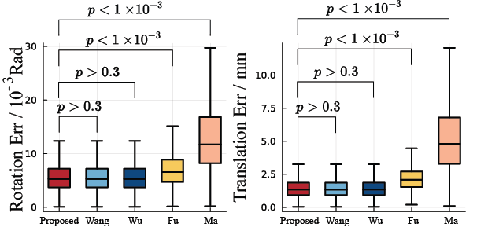

# GA_MultiRobot
Calibrate Multi Robot with Geometric Algebra (GA) and Geometric Calculus (GC). More specifically the $\mathbf{AXB=YCZ}$ problem.

## Problem Formulation


As an updated version of hand-eye calibration, $\mathbf{AXB=YCZ}$ aims at solving the hand-eye $\mathbf{X}$, base-base $\mathbf{Y}$, and hand-tool $\mathbf{Z}$ given two forward kinematics $\mathbf{A}$ and $\mathbf{C}$, and one measurement $\mathbf{B}$

## Folder Structure
* **utils**: fundamental functions such as basic GA calculation, robot kinematics, and GA robot kinematics.
* **project_utils**: the `DualRobotCalibrator` solver, which includes all the solver functions from the article and the reproduced version of other researchers' algorithms.
* **Benchmark**: the benchmark code for the proposed method and other algorithms.
* **Experiments**: scripts related to experimental pose generation, raw data (point cloud) processing, and final benchmarking.
* **images**: This folder contains all the saved results.
* **test**: some test scripts.

Each folder has its own README.md for detailed illustration.

## Installation:
You need to install `Julia` and `Matlab` ahead to run this package. We recommend `julia>1.8.1 < 1.9` and `MATLAB>2022b` for best performance and visualization.
1. You need to enter the folder in your terminal by `cd GA_MultiRobot` (or whatever you name the folder)
2. `dir` (windows) or `ls` (linux), and you should see all folder names and `Project.toml`, `Manifest.toml`
3. Activate and setup the project environment for `julia`
```julia
julia> ]
(@v1.8) pkg> activate .
(GA_MultiRobot) pkg> instantiate      # this may take long depends on your network condition
```

## Demo
Run the demo with the following command:
```
julia --project=. -O3 demo.jl
```
It may took a while for plotting, which is a known issue for julia and will be fixed in v1.9.x.

The result will be saved at `./image/demo.svg`. Noted that the result marked by "GA" is the unpublished version of the proposed method, which is based on Projective Geometric Algebra (PGA). The published version is based on $\mathbb{G}^3$, which is (definitely) more efficient and (probably) more accurate.

## Highlights

### High accuracy


Result in a measurement experiment. The proposed GA-based method reached identical optimal accuracy as Wang's (SOTA) and Wu's method, and higher accuracy than Fu's and Ma's method.

### High Efficiency
| Execution Time     | Flops |
| ----------- | ----------- |
|     |       |

The proposed method solves the problem ~4.5x faster with ~3.5x less computational load than SOTA.

## Benchmark
Read Benchmark.md for detailed benchmark.

## Related Methods
* Wang's method (previous SOTA): [Simultaneous calibration of multicoordinates for a dual-robot system by solving the AXB = YCZ problem](https://ieeexplore.ieee.org/document/7425217)
* Wu's method (previous SOTA): [Simultaneous Hand-Eye, Tool-Flange, and Robot-Robot Calibration for Comanipulation by Solving the AXB = YCZ Problem](https://ieeexplore.ieee.org/document/7425217)
* Fu's Method (A method based on Dual-quaternion): [A Dual Quaternion-Based Approach for Coordinate Calibration of Dual Robots in Collaborative Motion](https://ieeexplore.ieee.org/document/9072583)
* Ma's Method (temporal info free): [Probabilistic approaches to the AXB= YCZ calibration problem in multi-robot systems](https://link.springer.com/article/10.1007/s10514-018-9744-3)
* Bayro's AX=XB Method: [Motor algebra for 3D kinematics: the case of the hand-eye calibration](https://link.springer.com/article/10.1023/A:1026567812984)

## TODO

- [x] Upload Simulation Benchmark Code
- [ ] Upload Experiment Data & Benchmark Code
- [ ] Upload Experiment Video
- [ ] Port project to C++ for better usability and efficiency